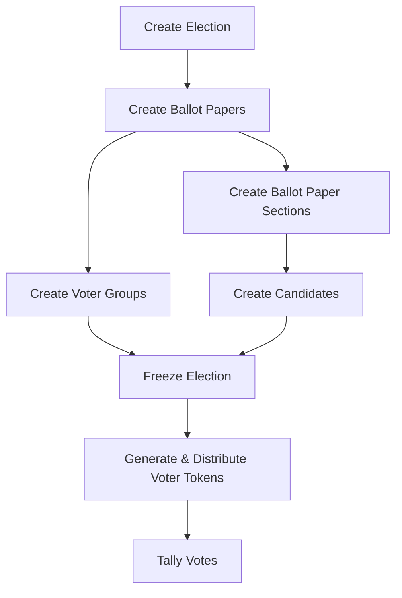

:::warning

This page is still under construction and will be updated soon.
Some screenshots are from Penpot and might differ from the actual implementation.

:::

You want to create an election?
Here is a tutorial on how you can set up an election on votura.
The basic workflow for creating an election is displayed in the following diagram:

## Preface

Before creating an election, it is important to understand, that **an election is intended to answer only one question**.
For example, "Who should be the next president?" or "Who should be the members of the new student council?".
This means that even though each election can have multiple ballot papers, all ballot papers should be related to the same question.

Furthermore, ballot papers within an election should have the same candidates, as the tallying of the votes is done on the election level and not on the ballot paper level.
This means, that if different candidates are used on different ballot papers of the same election, all votes for the candidates from all ballot papers will still be counted together and it will not be possible to see how many votes a candidate received on a specific ballot paper.
For example in the case of a council election, where students and teachers vote on different parts of the council, two elections should be created, one for the students and one for the teachers instead of creating one election with two different ballot papers and different candidates.

## Creating the Election

The first step for creating an election and enabling voters to vote on it is of course to create the election itself.
This is done in the elections view by clicking the `New Election` Button as can be seen in the following picture:

You will then be presented with a dialog to enter the details of the election, which looks like this:

Each election needs a name, which is intended to help voters and election creators to quickly identify what the purpose of an election is.

You can also add a description to the election, which can be used to provide more context about the election.

Each election also needs a start and end date.
This time frame defines when voters are allowed to vote in the election.

Finally, you can also choose to make the election private or public and allow invalid votes if you want to.
A public election can be seen as an informal vote, where each vote can be traced back to the voter.
This is useful for example in board meetings, where the board members want to vote on a topic, but want to be able to see who voted for what.
A private election on the other hand is more formal and is used for elections where the voters want to remain anonymous.
This is the case for example in student council elections, where the students want to vote for their representatives without being traced back to their votes.
Allowing invalid votes means that voters can submit a ballot paper which does not follow the rules of the election (e.g. voting for more candidates than allowed).
This often is allowed or even not preventable in formal elections such as parliamentary elections.
It allows voters to express their protest for example.
If invalid votes are not allowed, the voter will be notified that their vote is invalid and will have to correct it before being able to submit it.

The button for private elections is currently not implemented but it could look something like this:

After filling out the form, you can create the election by clicking the `Create new election` button.
It will then be visible in the elections view and you will automatically be redirected to the election detail view of the newly created election.
There you can see an overview of the election and its details as shown in the following picture:

If you want to edit, freeze or delete the election, you can do so by opening the menu in the top right corner.

## Creating Ballot Papers

The next step is to create the ballot papers for the election.
This is done in the election detail view by clicking the `New Ballot Paper` button as can be seen in the following picture:

Similar to the election creation, you will be presented with a dialog to enter the details of the ballot paper, which looks like this:

Each ballot paper needs a name, which is intended to help election creators to quickly identify the purpose of a ballot paper.
This is necessary, as an election can have multiple ballot papers.
With this, it is possible to have different voter groups voting on different ballot papers in the same election.
For example, in a student council election, the students and teachers could have different ballot papers, with the teacher ballot paper allowing for more votes than the student ballot paper.
Using different candidates on the different ballot papers is not recommended, as the tallying of the votes is done on the election level and not on the ballot paper level (see [the preface](#preface)).

You can also add a description to the ballot paper, which can be used to provide more context about the ballot paper.

Next, you need to define the maximum number of votes a voter can cast on this ballot paper.
This is the maximum number of votes a voter can cast as a sum of all sections of the ballot paper.
For example, if a ballot paper has two sections, one for party 1 and one for party 2, the sum of all votes cast in both sections must not exceed the maximum number of votes defined here.
If a voter casts more votes than allowed, the vote will be considered invalid (if invalid votes are allowed in the election settings).

Finally, the maximum number of votes per candidate needs to be defined.
This is the maximum number of votes a voter can cast for a single candidate on this ballot paper across all sections.
It needs to be smaller or equal to the maximum number of votes defined above.
For example, if a voter is allowed to cast 3 votes on a ballot paper, but only 1 vote per candidate, the voter can only vote for 3 different candidates, even if the same candidate appears in multiple sections of the ballot paper.
If a voter casts more votes for a single candidate than allowed, the vote will be considered invalid.

After filling out the form, you can create the ballot paper by clicking the `Create new ballot paper` button.

It will then be visible in the election detail view as part of a sort of board view, where you can see all ballot papers of the election.
They are displayed as cards, which show the name and description of the ballot paper as well as the sections within the ballot paper.
The sections can be scrolled vertically, the ballot papers themselves can be scrolled horizontally if there are multiple ballot papers.

You can edit or delete a ballot paper by opening the menu in the top right corner of the ballot paper card.
This is also where you can create new sections for the ballot paper by clicking the `Add Section` button.

## Creating Ballot Paper Sections

After creating a ballot paper, the next step is to create sections for the ballot paper.
This needs to be done even if the ballot paper is only intended to have one section, as candidates can only be added to sections and not directly to the ballot paper.

Creating a ballot paper section is done by clicking the `Add Section` button in the top right corner of the ballot paper card as shown in the previous screenshot.
You will then be presented with a dialog to enter the details of the ballot paper section, which looks like this:

Each ballot paper section needs a name, which is intended to help election creators and voters to quickly identify the purpose of a ballot paper section.
A ballot paper section can for example represent a party or a group of candidates.
For example, in a parliamentary election, each section could represent a party and the candidates within that section would be the candidates of that party.

You can also add a description to the ballot paper section, which can be used to provide more context about the section.

The Maximum Votes field for the section defines the maximum number of votes a voter can cast in this section.
This number needs to be smaller or equal to the maximum number of votes defined for the ballot paper.
In sum, the defined maximum votes for all sections of a ballot paper can exceed the maximum number of votes defined for the ballot paper itself.
The actual amount of votes a voter can cast however is always limited by the maximum number of votes defined for the ballot paper.
So even if section 1 allows for 5 votes and section 2 allows for 5 votes, but the ballot paper only allows for 6 votes, the voter can only cast a total of 6 votes across both sections.

Next, the maximum number of votes per candidate needs to be defined for the section.
This is the maximum number of votes a voter can cast for a single candidate within this section.
It needs to be smaller or equal to the maximum number of votes defined for the ballot section and the maximum number of votes per candidate defined for the ballot paper.
Same as with the maximum votes, the actual amount of votes a voter can cast for a single candidate is always limited by the maximum number of votes per candidate defined for the ballot paper.

After filling out the form, you can create the ballot paper section by clicking the `Create Section` button.

The section will then be added to the ballot paper and will be visible in the ballot paper card in the election detail view as shown in the following picture:

It can be edited or deleted by opening the menu in the top right corner of the section card.
The edit dialog is intended to look the same as the creation dialog shown above but it is not yet implemented.

## Creating Candidates

After creating a ballot paper section, the next step is to create candidates for the section or even the entire election.
This is done in the edit menu of the ballot paper section by clicking the `Add Candidate` button as shown in the following picture:

Similar to the previous creation dialogs, you will be presented with a dialog to enter the details of the candidate, which looks like this:

Each candidate needs a name, which is intended to help election creators and voters to quickly identify the candidate.
You can also add a description to the candidate, which can be used to provide more context about the candidate.

A candidate that is added to a ballot paper section is automatically part of the entire election and can be reused in other ballot paper sections of the same election.
If the same candidate is added to multiple sections, the votes for that candidate from all sections will be counted together in the final tally of the election.

Adding or removing an existing candidate to/from a ballot paper section is done in the edit menu of the ballot paper section by clicking the `Edit Candidates` button.
The dialog that opens looks like this:

Here, you can see all candidates that are part of the election and can add or remove them from the section by clicking the checkbox next to their name.
You can also delete candidates from the election entirely by clicking the trash can icon next to their name and edit them using the gear icon.

## Creating Voter Groups

Voter Groups are the votura way to assign voters to specific ballot papers.
A voter group consists of a name, an optional description and a number of voters.
A voter group can be assigned to vote on multiple elections but only one ballot paper per election.
When the voter tokens are generated, each voter token enables a voter to vote on each ballot paper assigned to the voter group.
Votura uses voter tokens so that the votura system never knows the real life identity of the voters.
Only the person distributing the voter tokens knows which voter token belongs to which real life voter.
This ensures the privacy of the voters.

A voter group can be created at any time but it can only be assigned to an election before the election is frozen and after a ballot paper has been created for the election.
This means that voter groups should be created after the elections have been created and must be created before the elections are frozen.

Creating a voter group is done on the `Voter Groups & Tokens` tab of the votura web app by clicking the `New Voter Group` button as shown in the following picture:

Clicking the button opens a dialog to enter the details of the voter group, which looks like this:

The number of voters determines how many voter tokens will be generated for the voter group when the election is frozen.
Each real world voter should get their own voter token and thus the number of voters should match the number of real world voters in the voter group.

As previously explained, the voter group can be assigned to vote on multiple elections but only one ballot paper per election.
This is done by selecting one of the radio buttons next to the ballot paper names in the elections list.
If no ballot paper is selected for an election, the voter group will not be able to vote in that election.

After filling out the form, you can create the voter group by clicking the `Create voter group` button.

A voter group can be edited or deleted by clicking on the gear icon next to the voter group in the voter groups list.
The dialog for this will look something like this:

This is also where the voter tokens can be generated after all elections linked to the voter group have been frozen.

## Freezing Elections

After creating an election and linking it to a voter group, the election needs to be frozen before voters can start voting.
For this a list of requirements needs to be met:

- The election must have at least one ballot paper.
- Each ballot paper must have at least one section.
- Each ballot paper section must have at least one candidate linked to it.
- All candidates linked to the election must be linked to at least one ballot paper section.

Note that freezing an election is an action that should be done with caution and after a careful review of the election configuration.
After an election is frozen, the configuration of the election can not be changed anymore.
You can not change the linked voter groups either.
This is to ensure the integrity of the election and to prevent any manipulation of the election after it has started.

An election can be frozen in the election detail view or in the elections list.
The following picture shows the button to freeze an election in the election list:

## Generating and Distributing Voter Tokens

After freezing an election, the next step is to generate and distribute voter tokens to the real world voters.
This is done in the `Voter Groups & Tokens` tab of the votura web app.
Here, you can see a list of all voter groups that have been created.
You can generate voter tokens for a voter group by clicking the gear icon next to the voter group and then clicking the `Generate Voter Tokens` button in the dialog that opens.
This button is only enabled if all elections linked to the voter group have been frozen.

After clicking the button, the specified number of voter tokens will be generated for the voter group and can be downloaded as a file, the type of which is still to be decided.
The voter tokens can then be distributed to the real world voters in the voter group.

## Tallying Votes

After the voting period has ended, the next step is to tally the votes.
This has not yet been designed or implemented but it could be done automatically after the end date of the election has been reached.
The ciphertexts that have been used for tallying then need to be made public, so that every voter can verify that their vote has been included in the tally.

## Unfreezing

Unfreezing a frozen election is possible but should only be done in exceptional cases.
For most use cases, creating a new election and declaring the old one as invalid is the better choice.
This is because unfreezing an election that voters have already voted in leads to the deletion of all votes that have been cast in the election.
Furthermore, if a voter group that is linked to the election to unfreeze is linked to another election where voting is in progress, the votes for that election will also be deleted.
The voter tokens for all such elections will also be invalidated and new voter tokens will need to be generated and distributed to the voters.

If you still want to unfreeze an election, this can be done in the election detail view or in the elections list, the same as freezing an election.
